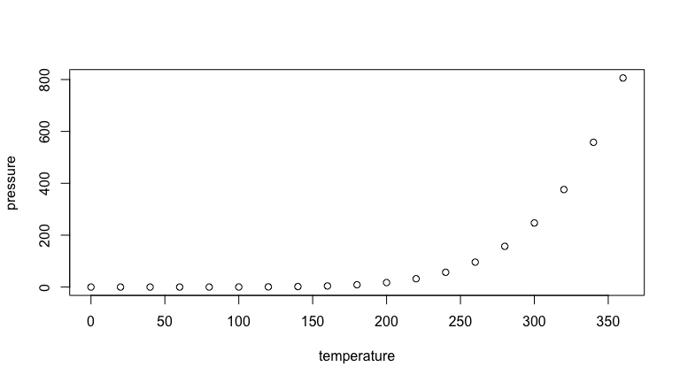

<!-- README.md is generated from README.Rmd. Please edit that file -->

# Project Title

<!-- badges: start -->
<!-- badges: end -->

One Paragraph of the project description.

- [Getting Started](#getting-Started)
  - [Prerequisites](#prerequisites)
  - [Installing](#installing)
- [Usage](#usage)
- [Authors](#authors)
- [Contributing](#contributing)
- [Acknowledgments](#acknowledgments)

## Getting Started

### Prerequisites

Requirements for the software and other tools to build, test and push -
[Example 1](https://www.example.com) - [Example
2](https://www.example.com)

### Installing

A step by step series of examples that tell you how to get a development
environment running

Say what the step will be

    Give the example

``` r
summary(cars)
#>      speed           dist       
#>  Min.   : 4.0   Min.   :  2.00  
#>  1st Qu.:12.0   1st Qu.: 26.00  
#>  Median :15.0   Median : 36.00  
#>  Mean   :15.4   Mean   : 42.98  
#>  3rd Qu.:19.0   3rd Qu.: 56.00  
#>  Max.   :25.0   Max.   :120.00
```

## How To Use

> \[!NOTE\] This is a note.



## Authors

- **[Someone](https://github.com/PurpleBooth)**

> [Something](https://github.com/)  ·  GitHub
> [@javiermtz](https://github.com/)  · 

See also the list of [contributors](https://github.com/) who
participated in this project.

## Contributing

Pull requests are welcome. For major changes, please open an issue first
to discuss what you would like to change.

Please make sure to update tests as appropriate.

## Acknowledgments

- This template is based on Billie Thompson’s template - [README
  Template](https://github.com/PurpleBooth/a-good-readme-template#readme)

## References

------------------------------------------------------------------------
